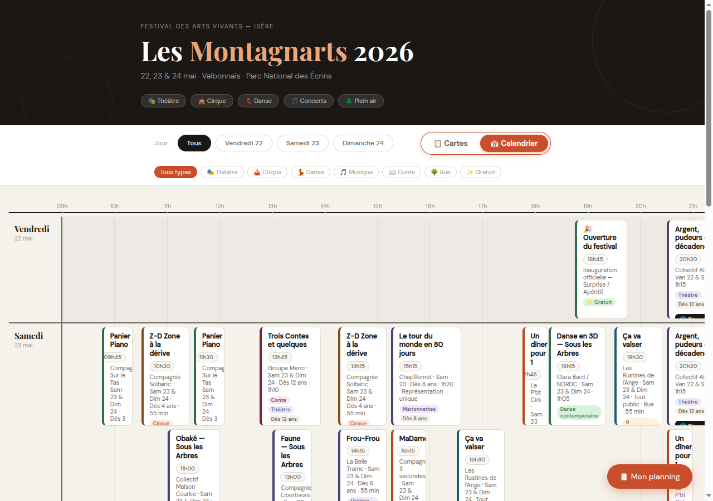
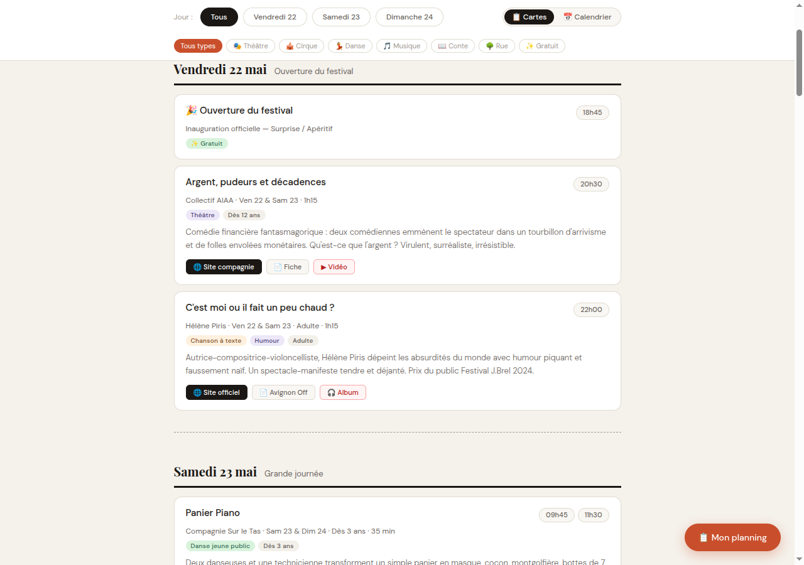
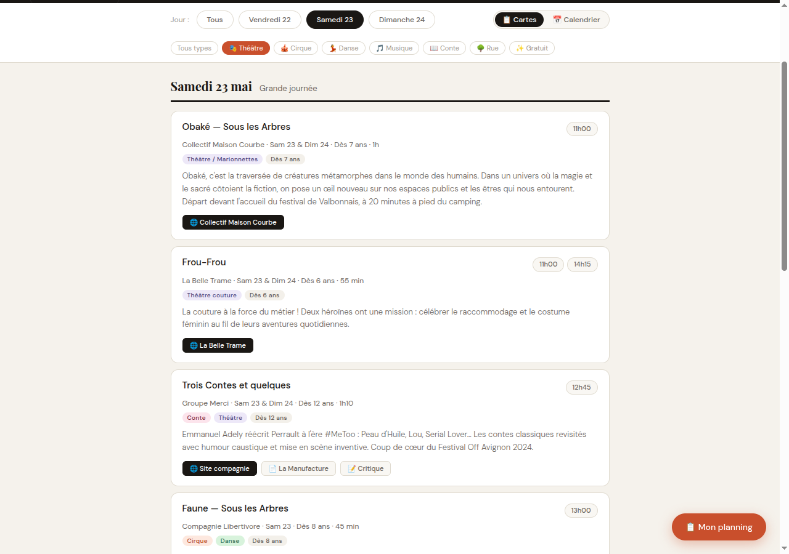
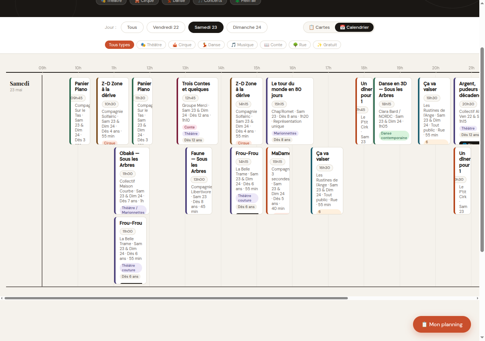
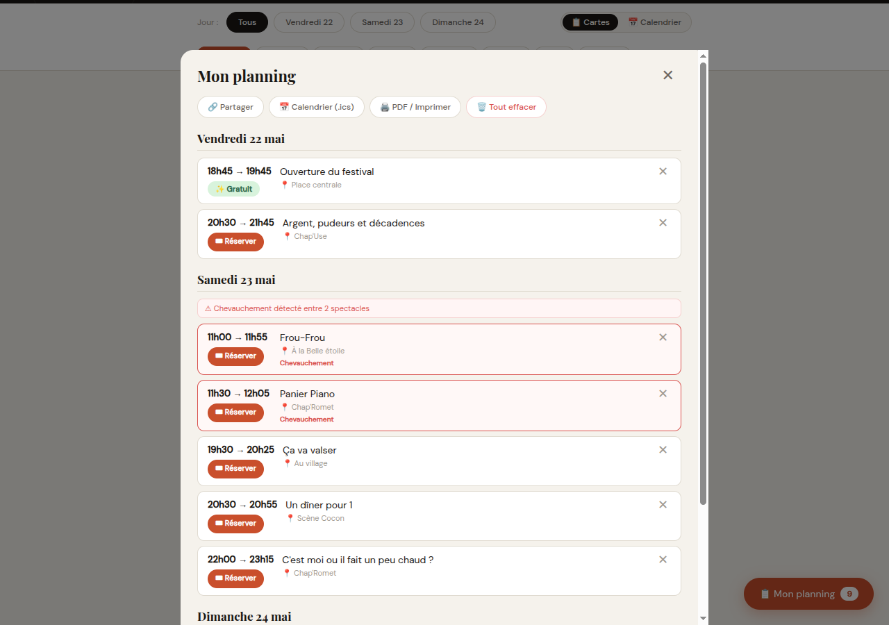

# Les Montagnarts 2026

Site officiel du programme du festival **Les Montagnarts 2026**, qui se tient à **Valbonnais** du **vendredi 22 au dimanche 24 mai 2026**.

👉 **Accès au site** : <https://yvalentin.github.io/montagnarts2026/>

Le site est conçu pour fonctionner depuis n'importe quel téléphone, tablette ou ordinateur, sans installation. Vos choix sont enregistrés localement dans votre navigateur — pas de compte, pas d'inscription.

---

## Sommaire

- [À quoi sert ce site ?](#à-quoi-sert-ce-site-)
- [Découvrir la programmation](#découvrir-la-programmation)
- [Construire son planning](#construire-son-planning)
- [Réserver une place](#réserver-une-place)
- [Partager, exporter, imprimer](#partager-exporter-imprimer)
- [Astuces & questions fréquentes](#astuces--questions-fréquentes)

---

## À quoi sert ce site ?

Le festival propose plus de **vingt spectacles** répartis sur trois jours, dans plusieurs lieux du village. Le site vous permet de :

- **Parcourir le programme** sous deux formes (cartes ou calendrier visuel) ;
- **Filtrer** par jour et par type de spectacle ;
- **Construire votre planning** en sélectionnant les séances qui vous intéressent ;
- **Repérer les conflits d'horaires** entre deux spectacles que vous voulez voir ;
- **Réserver** directement sur la billetterie pour les spectacles payants ;
- **Partager** votre planning à vos amis ou l'**exporter** vers votre agenda.

---

## Découvrir la programmation

### En arrivant sur le site

La page d'accueil affiche tous les spectacles, regroupés par jour. Chaque spectacle est représenté par une **carte** contenant :

- Le **titre** et la **compagnie** ;
- Une **courte description** ;
- Les **étiquettes** (théâtre, cirque, danse, etc.) ;
- Les **créneaux horaires** disponibles (un bouton par séance) ;
- Un **lien de réservation** quand le spectacle est payant.

### Filtrer le programme

Une barre de filtres reste affichée en haut de la page lorsque vous faites défiler le contenu.

**Par jour :**

| Filtre | Affichage |
|---|---|
| Tous | Les trois jours du festival |
| Vendredi 22 | Soirée d'ouverture uniquement |
| Samedi 23 | Journée complète |
| Dimanche 24 | Journée complète |

**Par type de spectacle :**

🎭 Théâtre · 🎪 Cirque · 💃 Danse · 🎵 Musique · 📖 Conte · 🌳 Rue · ✨ Gratuit

Cliquez sur un filtre pour ne voir que les spectacles correspondants. Cliquez sur **Tous** ou **Tous types** pour réafficher l'ensemble.

### Deux vues, au choix

À droite de la barre de filtres, un commutateur **📋 Cartes / 📅 Calendrier** permet de basculer entre :

- **📅 Calendrier** — **vue par défaut** à l'ouverture du site. Affichage type « planning » avec un axe horaire de 9h à 1h du matin : chaque spectacle est un bloc coloré positionné à son heure réelle. Idéal pour visualiser une journée en un coup d'œil et repérer les chevauchements.
- **📋 Cartes** — affichage sous forme de fiches détaillées regroupées par jour. Pratique pour lire les descriptions complètes et parcourir le programme à tête reposée.

Dans la vue **📅 Calendrier**, cliquez sur un bloc pour ouvrir la fiche détaillée du spectacle correspondant.

---

## Construire son planning

### Sélectionner une séance

Sur chaque carte (ou bloc du calendrier), les horaires sont affichés sous forme de **petites pastilles cliquables** (par exemple `20h30`).

- **Cliquez** sur une pastille pour ajouter la séance à votre planning. La pastille devient pleine et un ✓ apparaît.
- **Cliquez à nouveau** sur la même pastille pour la retirer.

Un compteur s'affiche en bas à droite de l'écran : **📋 Mon planning (3)** par exemple.

### Ouvrir mon planning

Cliquez sur le bouton **📋 Mon planning** en bas à droite. Un panneau s'ouvre et liste vos séances sélectionnées, **regroupées par jour** et **triées par heure**.

### Détecter les conflits

Si deux séances que vous avez choisies se chevauchent dans le temps, le site vous le signale par un **avertissement orange** sous les séances concernées. À vous de trancher : retirez l'une des deux en cliquant à nouveau sur sa pastille (depuis le programme ou directement depuis le planning).

### Sauvegarde automatique

Votre planning est **automatiquement enregistré** dans votre navigateur. Vous pouvez fermer l'onglet et revenir plus tard : vos choix seront toujours là.

⚠️ Attention : si vous changez d'appareil, ou si vous effacez les données de navigation, votre planning sera perdu. Pour le conserver, utilisez la fonction **Partager** (voir plus bas).

### Tout effacer

Dans le panneau **Mon planning**, le bouton **🗑️ Tout effacer** vide votre sélection. Une confirmation est demandée — l'action est définitive.

---

## Réserver une place

Certains spectacles nécessitent une **réservation** sur la billetterie officielle. Quand c'est le cas, un bouton **Réserver** apparaît à côté de la pastille horaire correspondante.

- Chaque créneau a son **propre lien de réservation** : un spectacle joué le samedi à 20h30 et le dimanche à 20h30 a deux liens distincts.
- Les spectacles marqués **✨ Gratuit** ne nécessitent pas de réservation : présentez-vous simplement sur place.
- Le lien de réservation ouvre la billetterie sur `lesmontagnarts.org` dans un nouvel onglet.

---

## Partager, exporter, imprimer

Ouvrez le panneau **📋 Mon planning** — trois options sont disponibles en haut :

### 🔗 Partager

Génère un **lien unique** contenant votre planning. Vous pouvez l'envoyer par SMS, e-mail ou messagerie : la personne qui ouvre le lien verra **exactement votre sélection** sur son propre appareil. Pratique pour se coordonner avec vos amis ou votre famille.

Ce lien sert aussi de **sauvegarde** : envoyez-le-vous à vous-même pour pouvoir le retrouver depuis un autre appareil.

### 📅 Calendrier (.ics)

Télécharge un fichier `.ics` que vous pouvez **importer dans votre agenda** : Google Agenda, Apple Calendar, Outlook, etc. Chaque séance devient un événement avec son lieu, son horaire et sa durée.

**Comment l'utiliser :**

1. Cliquez sur **📅 Calendrier (.ics)** — le fichier `montagnarts-2026.ics` se télécharge.
2. Ouvrez-le avec votre application d'agenda (double-clic sur ordinateur, ou ouvrir depuis le téléchargement sur mobile).
3. Validez l'import.

### 🖨️ PDF / Imprimer

Lance la fenêtre d'impression de votre navigateur. Au lieu d'imprimer toute la page, **seul votre planning** est mis en page proprement, lisible et compact. Dans la boîte de dialogue, choisissez **« Enregistrer au format PDF »** plutôt qu'une imprimante pour obtenir un fichier que vous pourrez conserver sur votre téléphone.

---

## Astuces & questions fréquentes

**Comment retrouver mon planning sur un autre appareil ?**
Utilisez **🔗 Partager** sur le premier appareil, envoyez-vous le lien, ouvrez-le sur le second. Votre planning s'y charge automatiquement.

**Je ne vois plus mon planning, que s'est-il passé ?**
Le planning est stocké dans votre navigateur. S'il a disparu, c'est probablement parce que les données du site ont été effacées (mode privé, nettoyage de l'historique, changement de navigateur). Si vous aviez créé un lien de partage, ouvrez-le pour restaurer.

**Comment ajouter rapidement plusieurs séances ?**
Activez d'abord le filtre **par type** (par exemple **🎭 Théâtre**) pour voir uniquement ce qui vous intéresse, puis cliquez sur les pastilles horaires des spectacles qui vous tentent.

**Comment savoir où a lieu un spectacle ?**
Le lieu (`Chap'Use`, `Chap'Romet`, `Place centrale`, etc.) est affiché sur la carte du spectacle et dans votre planning, à côté de chaque séance.

**Le site fonctionne-t-il hors-ligne ?**
La première visite nécessite une connexion. Ensuite, la consultation reste possible tant que la page est ouverte, même sans réseau. Les liens de réservation, eux, nécessitent toujours une connexion.

**Y a-t-il une application à installer ?**
Non. Le site fonctionne dans n'importe quel navigateur récent (Chrome, Safari, Firefox, Edge…). Sur smartphone, vous pouvez l'**ajouter à l'écran d'accueil** depuis le menu de votre navigateur pour le retrouver comme une appli.

**Comment contacter l'organisation ?**
Pour toute question sur la programmation : **programme@lesmontagnarts.org**.

---

Bon festival ! 🏔️
